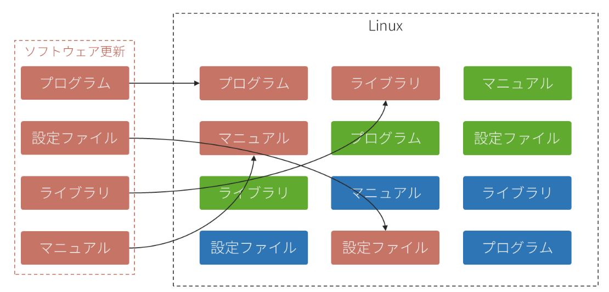
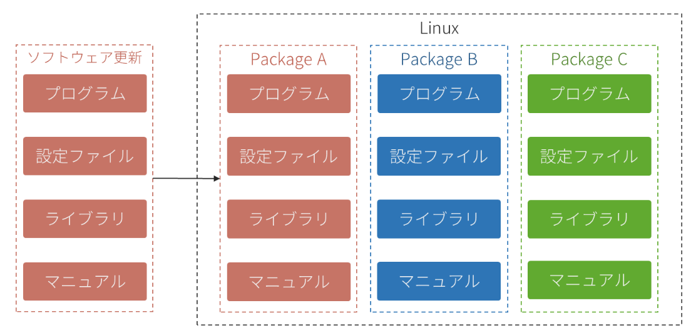
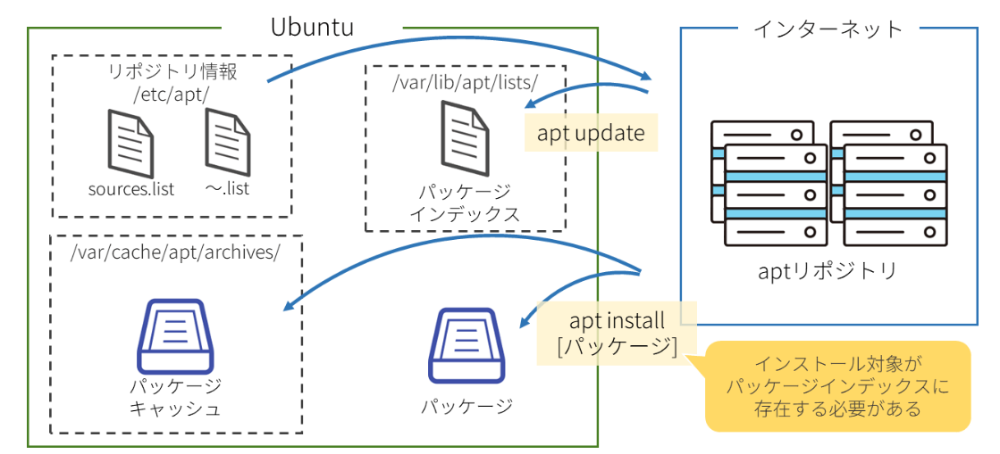
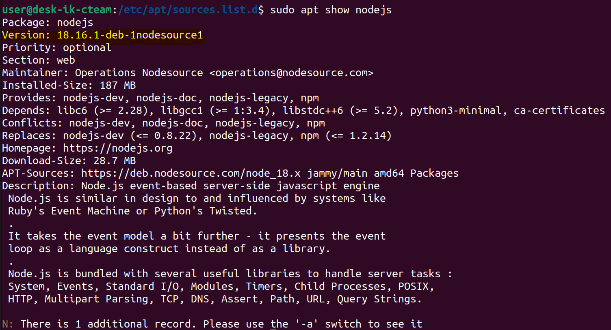
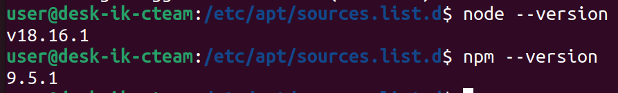
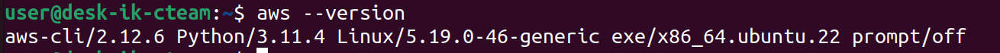
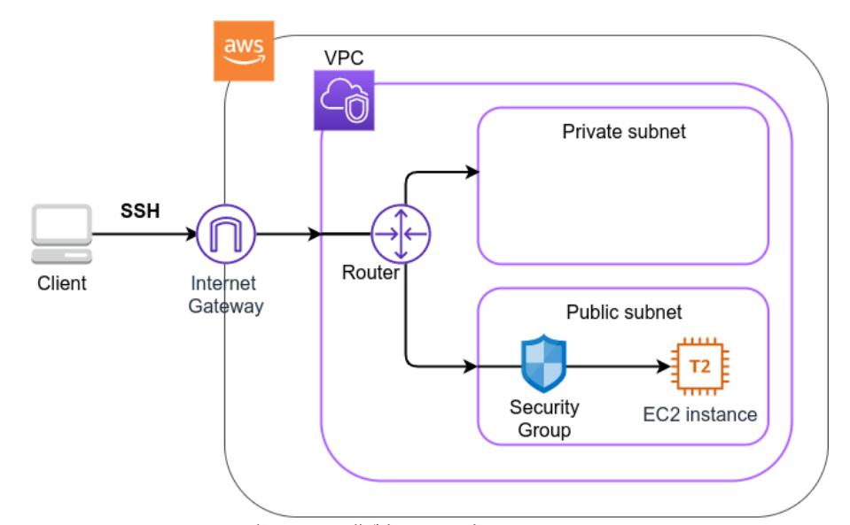
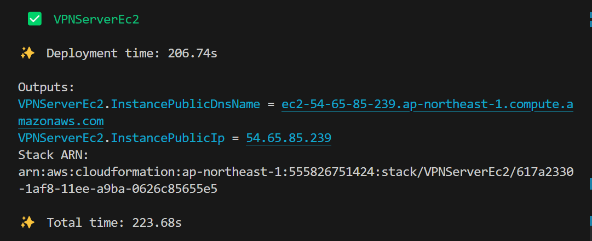
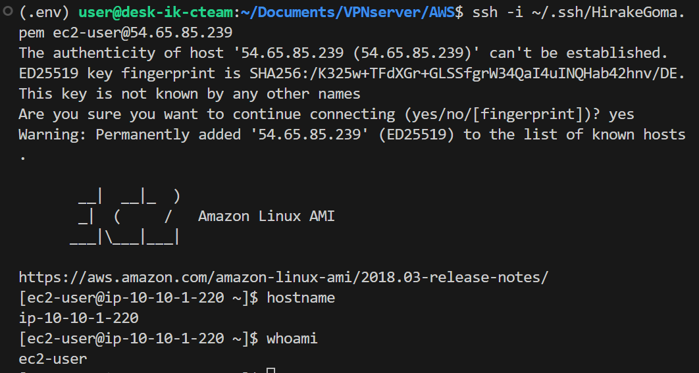
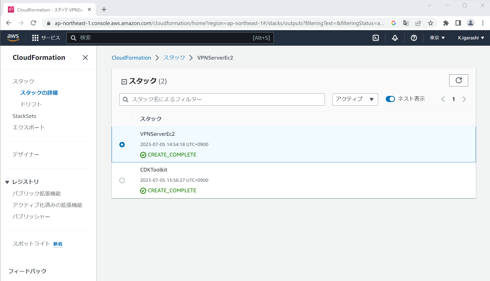

---

---

# SoftEther VPN 検証環境構築

https://chibinfra-techblog.com/softether-ssl-vpn-aws-to-local/

EC2の構築の参考に以下URLを利用する

https://tomomano.github.io/learn-aws-by-coding/#sec_first_ec2

node.jsのインストール

https://self-development.info/ubuntu-22-04-lts%E3%81%B8%E3%81%AE%E6%9C%80%E6%96%B0%E7%89%88node-js%E3%81%AE%E3%82%A4%E3%83%B3%E3%82%B9%E3%83%88%E3%83%BC%E3%83%AB/

脱線してaptに関する記事

https://zenn.dev/ikkik/articles/ffa45ed1fe5a1a

aptはソフトウェアの管理を簡易にするために**パッケージ**という概念を導入し管理しやすくしたもの

■手でダウンロードしていると... どのファイルがどのソフトウェアのものかわからない



■パッケージで管理しておくと... 管理が楽



dpkgはaptの前身である

### aptリポジトリ

大量のパッケージ情報を集約・保存・管理している**サーバ**。`apt`コマンドはaptリポジトリからダウンロード&インストールを行っている

aptリポジトリには`ubuntu公式のもの`と`サードパーティー`のものがある

ubuntu公式のリポジトリは`/etc/apt/source.list`に記述され、サードパーティのリポジトリ情報は`/etc/apt/sources.list.d`以下に「～.list｣または「～.source」というファイル名で記述する

### aptインストール

```
sudo apt update
```

aptリポジトリからパッケージインデックスを取得するコマンド。`/var/lib/apt/lists/`に格納される

```
sudo apt install [パッケージ]
```

aptリポジトリからパッケージをダウンロード&インストールするコマンド。インストール時のパッケージを`/var/cache/apt/archives/`にキャッシュする。`sudo apt-get clean`でキャッシュクリアできる



### サードパーティリポジトリの登録

`/etc/apt/sources.list.d`に「～.list｣または「～.source」を登録する

パッケージの署名検証に用いるOpenPGP公開鍵のインポートもする必要がある

#### 【A】バイナリ形式OpenPGP公開鍵の登録方法

1. リポジトリが公開しているOpenPGP公開鍵を取得する

   ```
   sudo wget -qO ~/【myrepo.asc】 【https://myrepo.example/myrepo.asc】
   ```

2. 【ASCII armored形式（テキスト形式）の場合】`gpg`コマンドでデコードする

   ```
   sudo gpg --dearmor -o ~/【myrepo】.gpg ~/【myrepo.asc】
   ```

3. OpenPGP公開鍵を`/etc/apt/keyrings/`に格納する（拡張子「gpg」）

   ```
   sudo mv /etc/apt/keyrings/【myrepo】.gpg
   ```

4. `/etc/apt/sources.list.d/`配下にリポジトリ情報ファイル（～.list）を作成する。その際、Signed-Byオプションで公開鍵のパスを指定する

   ```bash
   echo "deb [arch="$(dpkg --print-architecture)" signed-by=/etc/apt/keyrings/【myrepo】.gpg] 【https://myrepo.example】 "$(lsb_release -cs)" 【example】" | sudo tee /etc/apt/sources.list.d/【myrepo】.list > /dev/null
   ```

   

#### 【B】ASCII armored形式OpenPGP公開鍵の登録方法①

1. リポジトリが公開しているOpenPGP公開鍵を取得する

   ```
   sudo curl -fsSLo ~/【myrepo】.asc 【https://myrepo.example/myrepo.asc】
   ```

2. OpenPGP公開鍵を`/etc/apt/keyrings/`に格納する（拡張子「asc」）

   ```
   sudo mv /etc/apt/keyrings/【myrepo】.asc
   ```

3. `/etc/apt/sources.list.d/`配下にリポジトリ情報ファイル（～.list）を作成する。その際、Signed-Byオプションで公開鍵のパスを指定する

   ```
   echo "deb [arch="$(dpkg --print-architecture)" signed-by=/etc/apt/keyrings/【myrepo】.asc] 【https://myrepo.example】 "$(lsb_release -cs)" 【example】" | sudo tee /etc/apt/sources.list.d/【myrepo】.list > /dev/null
   ```

   

#### 【C】ASCII armored形式OpenPGP公開鍵の登録方法②

1. `/etc/apt/sources.list.d/`配下にリポジトリ情報ファイル（～.sources）を、DEB822スタイルで作成する。その際、Signed-ByオプションでOpenPGP公開鍵を直接記載する

   ```bash
   cat << EOS | sudo tee /etc/apt/sources.list.d/【myrepo】.sources > /dev/null
   Types: deb
   URIs: 【https://myrepo.example】
   Suites: $(lsb_release -cs)
   Components: 【example】
   Architectures: $(dpkg --print-architecture)
   Signed-By:
   $(curl -fsSL 【https://myrepo.example/myrepo.asc】 | sed "s/^/ /")
   EOS
   ```

##### インストール済みのパッケージの表示

```
sudo apt list --installed | grep curl
```


### node.jsのインストール

https://zenn.dev/khsmty/articles/installing_the_latest_nodejs_on_ubuntu_and_debian

```
$ curl -fsSL https://deb.nodesource.com/setup_lts.x | sudo -E bash -
```


```bash
## Installing the NodeSource Node.js 18.x repo...


## Populating apt-get cache...

+ apt-get update
Hit:1 http://jp.archive.ubuntu.com/ubuntu jammy InRelease                                                 
Hit:2 http://security.ubuntu.com/ubuntu jammy-security InRelease                                          
Hit:3 http://jp.archive.ubuntu.com/ubuntu jammy-updates InRelease
Hit:4 http://jp.archive.ubuntu.com/ubuntu jammy-backports InRelease
Reading package lists... Done

## Confirming "jammy" is supported...

+ curl -sLf -o /dev/null 'https://deb.nodesource.com/node_18.x/dists/jammy/Release'

## Adding the NodeSource signing key to your keyring...

+ curl -s https://deb.nodesource.com/gpgkey/nodesource.gpg.key | gpg --dearmor | tee /usr/share/keyrings/nodesource.gpg >/dev/null

## Creating apt sources list file for the NodeSource Node.js 18.x repo...

+ echo 'deb [signed-by=/usr/share/keyrings/nodesource.gpg] https://deb.nodesource.com/node_18.x jammy main' > /etc/apt/sources.list.d/nodesource.list
+ echo 'deb-src [signed-by=/usr/share/keyrings/nodesource.gpg] https://deb.nodesource.com/node_18.x jammy main' >> /etc/apt/sources.list.d/nodesource.list

## Running `apt-get update` for you...

+ apt-get update
Hit:1 http://jp.archive.ubuntu.com/ubuntu jammy InRelease                                          
Hit:2 http://security.ubuntu.com/ubuntu jammy-security InRelease                                   
Get:3 https://deb.nodesource.com/node_18.x jammy InRelease [4,563 B]
Hit:4 http://jp.archive.ubuntu.com/ubuntu jammy-updates InRelease
Hit:5 http://jp.archive.ubuntu.com/ubuntu jammy-backports InRelease
Get:6 https://deb.nodesource.com/node_18.x jammy/main amd64 Packages [776 B]
Fetched 5,339 B in 5s (1,024 B/s)
Reading package lists... Done

## Run `sudo apt-get install -y nodejs` to install Node.js 18.x and npm
## You may also need development tools to build native addons:
     sudo apt-get install gcc g++ make
## To install the Yarn package manager, run:
     curl -sL https://dl.yarnpkg.com/debian/pubkey.gpg | gpg --dearmor | sudo tee /usr/share/keyrings/yarnkey.gpg >/dev/null
     echo "deb [signed-by=/usr/share/keyrings/yarnkey.gpg] https://dl.yarnpkg.com/debian stable main" | sudo tee /etc/apt/sources.list.d/yarn.list
     sudo apt-get update && sudo apt-get install yarn
```



```bash
sudo apt install -y nodejs
```




### AWS - CLIインストール

```
curl "https://awscli.amazonaws.com/awscli-exe-linux-x86_64.zip" -o "awscliv2.zip"
unzip awscliv2.zip
sudo ./aws/install
```



```bash
aws configure

Default region name [None]: ap-northeast-1
Default output format [None]: json
```

```bash
# 確認用コマンド
cat ~/.aws/credentials
cat ~/.aws/config
```


### AWS CDKのインストール

https://docs.aws.amazon.com/ja_jp/cdk/v2/guide/getting_started.html

```
sudo npm install -g aws-cdk
```

```bash
user@desk-ik-cteam:~$ cdk --version
2.86.0 (build 1130fab)
user@desk-ik-cteam:~$ cdk bootstrap

Specify an environment name like 'aws://123456789012/us-east-1', or run in a directory with 'cdk.json'.
user@desk-ik-cteam:~$ aws sts get-caller-identity
{
    "UserId": "555826751424",
    "Account": "555826751424",
    "Arn": "arn:aws:iam::555826751424:root"
}
user@desk-ik-cteam:~$ aws configure get region
ap-northeast-1
user@desk-ik-cteam:~$ cdk bootstrap aws://555826751424/ap-northeast-1
 ⏳  Bootstrapping environment aws://555826751424/ap-northeast-1...
Trusted accounts for deployment: (none)
Trusted accounts for lookup: (none)
Using default execution policy of 'arn:aws:iam::aws:policy/AdministratorAccess'. Pass '--cloudformation-execution-policies' to customize.
CDKToolkit: creating CloudFormation changeset...
 ✅  Environment aws://555826751424/ap-northeast-1 bootstrapped.

```


### デプロイ用のコード準備

作成する環境（VPNServerにするためには少し改変が必要？）




### コード実行

```
python -m venv .env
source .env/bin/activate
pip install -r requirements.txt
```


### 秘密鍵の作成

```
$ export KEY_NAME="HirakeGoma"
$ aws ec2 create-key-pair --key-name ${KEY_NAME} --query 'KeyMaterial' --output text > ${KEY_NAME}.pem
$ mv HirakeGoma.pem ~/.ssh/
$ chmod 400 ~/.ssh/HirakeGoma.pem
```

#### デプロイ

```
cdk deploy -c key_name="HirakeGoma"
```




#### SSHでログイン

```
ssh -i ~/.ssh/HirakeGoma.pem ec2-user@54.65.85.239
```




#### スタックの確認（コンソール画面から）

CloudFormationを使うことでリソースを一度に管理・削除することができて便利




#### スタックの削除

```
cdk destroy

aws ec2 delete-key-pair --key-name "HirakeGoma"
rm -f ~/.ssh/HirakeGoma.pem
```


### Softetherのダウンロード

https://www.happylifecreators.com/blog/20220606/

この記事にあるdocker imageを使わせていただこうかと思う

```bash
$ sudo yum install -y docker
$ sudo systemctl start docker.service
$ sudo systemctl enable docker.service

$ sudo docker run -d --privileged -p 500:500/udp -p 4500:4500/udp -p 1701:1701/tcp -p 5555:5555/tcp -e PSK='{事前共有キー}' -e USERS='{ユーザ}:{パスワード}' -e SPW='{管理亜g面のパスワード}' -v /home/ec2-user/vpn_server.config:/usr/vpnserver/vpn_server.config --name softether siomiz/softethervpn

```

```
ssh -i ~/.ssh/HirakeGoma.pem ec2-user@3.112.29.220
```

https://ja.softether.org/4-docs/1-manual/7/7.3

https://jp.softether-download.com/files/softether/v4.38-9760-rtm-2021.08.17-tree/Linux/SoftEther_VPN_Server/64bit_-_Intel_x64_or_AMD64/

```
sudo yum -y install gcc

wget https://jp.softether-download.com/files/softether/v4.38-9760-rtm-2021.08.17-tree/Linux/SoftEther_VPN_Server/64bit_-_Intel_x64_or_AMD64/softether-vpnserver-v4.38-9760-rtm-2021.08.17-linux-x64-64bit.tar.gz -O softether-vpnserver-v4.38-9760-rtm-2021.08.17-linux-x64-64bit.tar.gz

tar xavf 
make
```

```
cd /home/ec2-user/
ls
mv vpnserver/ /usr/local/
ls -la /usr/local/vpnserver/
```

```
[root@ip-10-10-0-55 vpnserver]# chmod 600 *
[root@ip-10-10-0-55 vpnserver]# chmod 700 vpncmd
[root@ip-10-10-0-55 vpnserver]# chmod 700 vpnserver
```

動作チェック

```
[root@ip-10-10-0-55 vpnserver]# ./vpncmd 
vpncmd command - SoftEther VPN Command Line Management Utility
SoftEther VPN Command Line Management Utility (vpncmd command)
Version 4.38 Build 9760   (English)
Compiled 2021/08/17 22:32:49 by buildsan at crosswin
Copyright (c) SoftEther VPN Project. All Rights Reserved.

By using vpncmd program, the following can be achieved. 

1. Management of VPN Server or VPN Bridge 
2. Management of VPN Client
3. Use of VPN Tools (certificate creation and Network Traffic Speed Test Tool)

Select 1, 2 or 3: 3

VPN Tools has been launched. By inputting HELP, you can view a list of the commands that can be used.

VPN Tools>check
Check command - Check whether SoftEther VPN Operation is Possible
---------------------------------------------------
SoftEther VPN Operation Environment Check Tool

Copyright (c) SoftEther VPN Project.
All Rights Reserved.

If this operation environment check tool is run on a system and that system passes, it is most likely that SoftEther VPN software can operate on that system. This check may take a while. Please wait...

Checking 'Kernel System'... 
              Pass
Checking 'Memory Operation System'... 
              Pass
Checking 'ANSI / Unicode string processing system'... 
              Pass
Checking 'File system'... 
              Pass
Checking 'Thread processing system'... 
              Pass
Checking 'Network system'... 
              Pass

All checks passed. It is most likely that SoftEther VPN Server / Bridge can operate normally on this system.

The command completed successfully.
```

```
[root@ip-10-10-0-55 vpnserver]# vi /etc/init.d/vpnserver 
[root@ip-10-10-0-55 vpnserver]# chmod 755 /etc/init.d/vpnserver 
[root@ip-10-10-0-55 vpnserver]# /sbin/chkconfig --add vpnserver 
```


```bash
# /etc/init.d/vpnserver

#!/bin/sh
# chkconfig: 2345 99 01
# description: SoftEther VPN Server
DAEMON=/usr/local/vpnserver/vpnserver
LOCK=/var/lock/subsys/vpnserver
test -x $DAEMON || exit 0
case "$1" in
start)
$DAEMON start
touch $LOCK
;;
stop)
$DAEMON stop
rm $LOCK
;;
restart)
$DAEMON stop
sleep 3
$DAEMON start
;;
*)
echo "Usage: $0 {start|stop|restart}"
exit 1
esac
exit 0
```

```
echo 1 >/proc/sys/net/ipv4/ip_forward
vi /etc/sysctl.conf
```


### Softether VPN マネージャーのインストール

会社のwindowsにダウンロードしてAV検知や脆弱性検知されると嫌だなと思ったので、以降は自身のPCで実施することにした。

